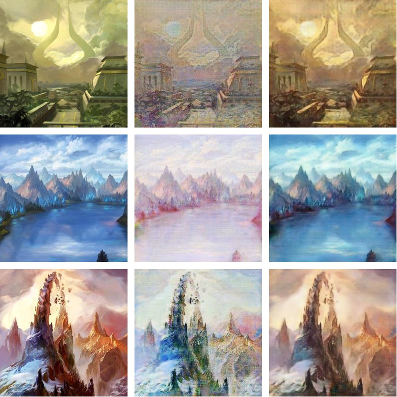

# GANLands

Style Transfer with CycleGAN on land art from Magic: The Gathering. Model implemented with 
PyTorch 1.6's automated mixed precision training. Magic land art is from [https://basiclandart.com/](https://basiclandart.com/). 

All credits go to the authors of the original CycleGAN paper, Jun-Yan Zhu, Taesung Park, Phillip Isola, and Alexei A. Efros. Link to the paper can be found [here](https://arxiv.org/abs/1703.10593). Link to the author's implementation can be found [here](https://github.com/junyanz/pytorch-CycleGAN-and-pix2pix).

# Examples

Some examples trained on art by Claude Monet. Results below were trained on a Nvidia RTX 2060 Super for 200 epochs. The two domain datasets consisted of 360 images of size 256 x 256. Total training time was around 16 hours. Columns from left to right: original, generated style transfer result, generated cycle consistent result.

